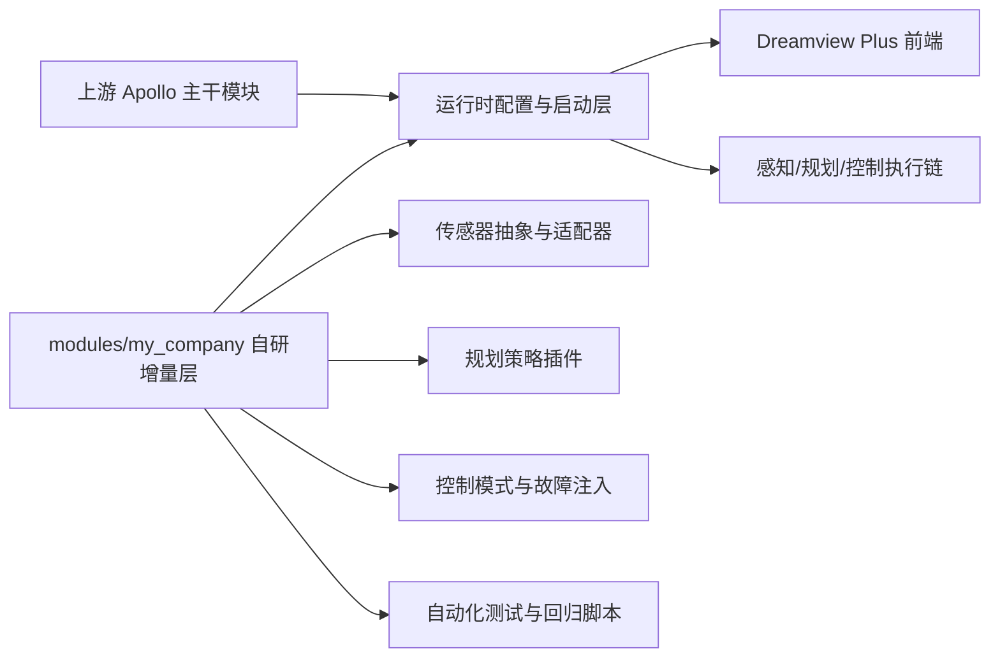
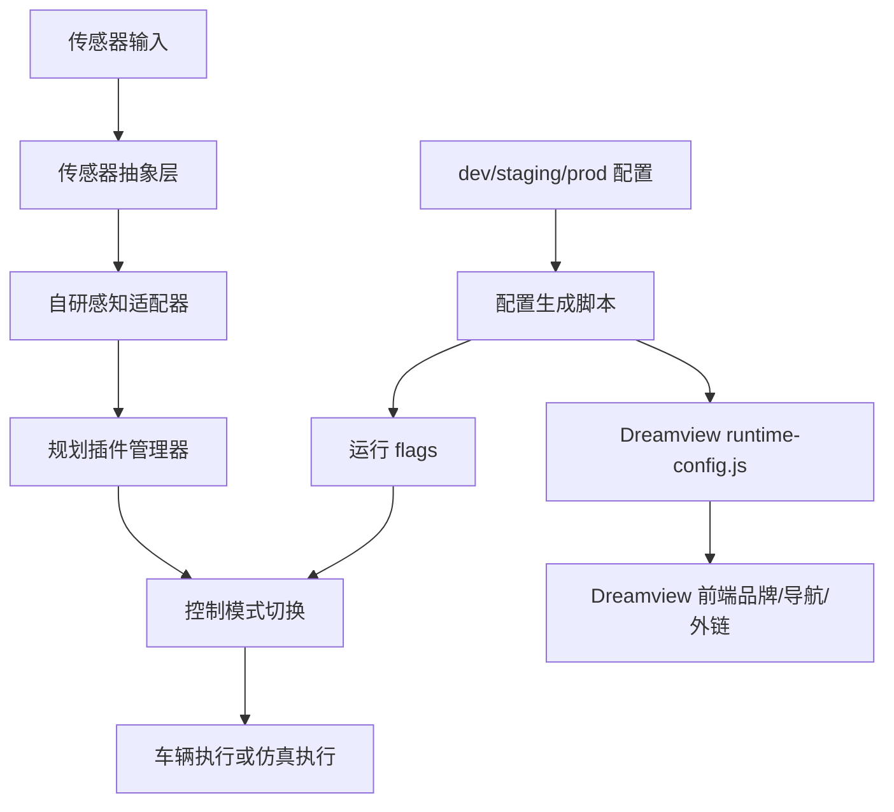

# Modified by however-yir autonomous driving team

# 然途自动驾驶平台（基于 Apollo 的企业化分支）

🔥 面向企业量产导向场景的自动驾驶研发底座，基于 Apollo 主干做“低侵入、可持续升级”的工程化改造。  
🚀 核心策略是“只加不改”：优先新增 `modules/my_company/*`，通过适配器和配置注入承载自研能力。  
⭐ 覆盖 Dreamview 品牌化、环境分层配置、插件化规划、控制双模式、安全测试、回归基准与运维文档全链路。

<p align="center">
  面向线控乘用车平台的企业化自动驾驶工程仓库（研发 / 回归 / 部署 / 运维）
</p>

<p align="center">
  
  
  
  
  
</p>

---

## 目录

- [1. 项目概述](#1-项目概述)
- [2. 项目定位与适用对象](#2-项目定位与适用对象)
- [3. 建设目标与设计原则](#3-建设目标与设计原则)
- [4. 30 项改造落地清单（逐条对照）](#4-30-项改造落地清单逐条对照)
- [5. 架构总览](#5-架构总览)
- [6. 核心模块拆解](#6-核心模块拆解)
- [7. 配置分层与配置注入](#7-配置分层与配置注入)
- [8. Dreamview 品牌与前端改造](#8-dreamview-品牌与前端改造)
- [9. 工程基线与安全策略](#9-工程基线与安全策略)
- [10. 测试与质量保障](#10-测试与质量保障)
- [11. 项目结构](#11-项目结构)
- [12. 快速开始](#12-快速开始)
- [13. 部署与运行顺序](#13-部署与运行顺序)
- [14. 常见问题](#14-常见问题)
- [项目设计补充](#项目设计补充)
- [15. 路线图](#15-路线图)
- [16. 上游同步策略](#16-上游同步策略)
- [17. 文档导航](#17-文档导航)
- [18. 贡献建议](#18-贡献建议)
- [19. 免责声明](#19-免责声明)
- [20. 许可证与版权说明](#20-许可证与版权说明)

---

## 1. 项目概述

本仓库是 `ApolloAuto/apollo` 的企业化分支，面向“可持续迭代、可控风险、可回归验证”的自动驾驶工程落地需求。

与常见“直接改主干”的改造方式不同，本项目采用分层扩展思路：

1. 主干优先保持稳定，减少升级冲突面。
2. 自研逻辑集中到新增目录 `modules/my_company/*`。
3. 配置、环境、外部依赖全部可注入，避免把部署差异写死在代码里。
4. 通过测试基线和文档体系，把研发能力转成可交付能力。

当前仓库已经形成从“模块新增 → 前端改造 → 配置分层 → 测试回归 → 运维文档 → 上游同步节奏”的完整闭环。

---

## 2. 项目定位与适用对象

### 2.1 项目定位

本项目不是单一演示工程，而是面向真实研发团队的自动驾驶工程底座，重点解决：

- 上游升级与自研改造之间的冲突问题。
- 多环境（`dev/staging/prod`）配置切换问题。
- 传感器厂商耦合和外部服务地址硬编码问题。
- 功能迭代后缺乏统一验证链路的问题。

### 2.2 适用对象

- 需要基于 Apollo 快速构建企业化能力的自动驾驶团队。
- 需要做 Dreamview 品牌化、导航重构、外链接入的前端团队。
- 需要建立插件化规划、控制模式切换、安全测试开关的 PnC 团队。
- 需要部署手册、排障手册、回归脚本、月度同步机制的交付与运维团队。

### 2.3 目标场景（当前假设）

- 线控中型乘用车平台（支持 steer-by-wire / brake-by-wire / throttle-by-wire）。
- 城市低速园区、限定开放道路、仿真联调等研发场景。
- 支持“仿真模式 / 实车模式”双运行形态。

---

## 3. 建设目标与设计原则

### 3.1 建设目标

- 构建稳定的 Apollo 企业化分支，支持长期维护。
- 建立可扩展的自研能力层，降低对主干的侵入。
- 打通从配置、启动、测试、回归到交付文档的工程链路。
- 形成可执行的上游同步机制，确保长期可持续。

### 3.2 设计原则

- **只加不改**：优先新增模块，尽量不直接重写上游核心逻辑。
- **配置优先**：环境差异由配置描述，不由代码分支硬编码。
- **厂商解耦**：传感器和外部服务通过抽象层与适配器接入。
- **可验证**：每一类改造都对应自动化检查、回归脚本或文档规范。
- **可交付**：研发成果必须可部署、可排障、可传递。

---

## 4. 30 项改造落地清单（逐条对照）

| 序号 | 需求项 | 落地方式 | 关键路径 |
|---|---|---|---|
| 1 | 建立“只加不改”原则 | 在文档与目录层面明确新增承载层，避免硬改主干 | `README.md`、`modules/my_company/README.md` |
| 2 | 新建 `modules/my_company/*` 承载自研 | 新增自研总目录及子模块 | `modules/my_company/*` |
| 3 | Dreamview 品牌名/Logo 全替换 | 新增运行时品牌配置与 logo 资源 | `.../runtimeConfig.ts`、`.../public/brand/hwp-logo.svg` |
| 4 | Dreamview 主题色与导航重构 | 主题色替换 + 菜单顺序配置化 | `dreamview-theme/*/base.ts`、`Menu/index.tsx` |
| 5 | 地图路径、存储地址参数化 | 运行时参数映射为 flags | `generate_runtime_artifacts.py`、`dreamview_gflags.cc` |
| 6 | 外部服务地址配置注入 | 用户菜单外链从配置读取 | `Menu/User/index.tsx`、`runtime-config.js` |
| 7 | 配置按 dev/staging/prod 分层 | 三套环境 JSON + 生成脚本 | `modules/my_company/config/environments/*.json` |
| 8 | 传感器抽象层（厂商解耦） | 抽象接口 + 注册中心 | `modules/my_company/common/sensor/*` |
| 9 | 自研感知适配器接入 | 通过适配器层接入，不硬改主干 | `modules/my_company/perception_adapter/*` |
| 10 | 规划策略插件接口 | 定义插件接口与管理器 | `modules/my_company/planning_plugin/*` |
| 11 | 控制模块仿真/实车双模式 | 模式开关组件化实现 | `modules/my_company/control/control_mode_switch.*` |
| 12 | 新增故障注入开关 | 故障注入门控组件 | `modules/my_company/control/fault_injection_switch.*` |
| 13 | 依赖版本统一基线 | Bazel/Node/Python 等版本统一 | `modules/my_company/config/dependency_baseline.yaml` |
| 14 | 前端依赖安全升级 | 新增 `security:audit` 与 CI 审计流 | `frontend/package.json`、`.github/workflows/frontend-security-audit.yml` |
| 15 | C++ 编译选项加 sanitizer | 增加 ASAN/UBSAN/TSAN 配置 | `tools/bazel.rc` |
| 16 | 新增模块单元测试覆盖 | 每个核心新增模块提供单测 | `modules/my_company/*/*_test.cc` |
| 17 | 场景回放自动化测试 | 回放脚本纳入测试脚本组 | `modules/my_company/tests/run_scenario_replay.sh` |
| 18 | CARLA 闭环回归基准 | CARLA 回归脚本化 | `modules/my_company/tests/run_carla_closed_loop_regression.sh` |
| 19 | 性能基准（CPU/GPU/延迟） | 性能采集脚本化 | `modules/my_company/tests/run_perf_benchmark.sh` |
| 20 | 接口兼容测试（消息变更） | Proto hash 对比与基线文件 | `interface_compatibility_check.py`、`proto_baseline_sha256.json` |
| 21 | 模块拓扑图与数据流图 | 提供 Mermaid 架构图文档 | `docs/my_company/topology_and_dataflow.md` |
| 22 | 部署手册（机器/驱动/依赖/启动序） | 完整部署手册 | `docs/my_company/deployment_manual.md` |
| 23 | 故障排障手册（常见报错） | 常见问题与诊断命令 | `docs/my_company/troubleshooting_manual.md` |
| 24 | 重写 README（用途/车型/差异） | 根 README 企业化重写 | `README.md` |
| 25 | 新增路线图（季度里程碑） | Q2 2026 至 Q1 2027 路线图 | `docs/my_company/roadmap.md` |
| 26 | 保留 Apache-2.0 LICENSE 和 NOTICE | 保留 LICENSE 并新增 NOTICE | `LICENSE`、`NOTICE` |
| 27 | 改动文件标注 `Modified by ...` | 已在改动文件中加标注 | 关键改动文件均含标注 |
| 28 | 仓库 Topics 改为产品定位 | 已按业务定位设置主题标签 | GitHub 仓库元数据 |
| 29 | 仓库描述改为业务场景 | 已更新仓库 description | GitHub 仓库元数据 |
| 30 | 每月一次 upstream rebase 节奏 | 脚本 + GitHub Actions 定时任务 | `scripts/maintenance/monthly_upstream_rebase.sh`、`monthly-upstream-rebase.yml` |

---

## 5. 架构总览

### 5.1 逻辑架构（主干 + 自研增量层）



### 5.2 数据流与控制流（简化）



### 5.3 项目规模速览（当前仓库统计）

- `modules/my_company` 新增文件：`39` 个。
- `modules/my_company` 内 C++ 头源文件：`18` 个。
- 自研测试脚本/基线文件：`7` 个。
- 新增运维与交付文档：`6` 份。

---

## 6. 核心模块拆解

### 6.1 `modules/my_company/common/sensor`

作用：定义传感器抽象接口和注册中心，实现厂商解耦。

关键文件：

- `sensor_adapter.h`
- `sensor_adapter_registry.h`
- `sensor_adapter_registry.cc`
- `sensor_adapter_registry_test.cc`

### 6.2 `modules/my_company/perception_adapter`

作用：作为自研感知模块与主系统的接入点，保持主干稳定。

关键文件：

- `my_perception_adapter.h`
- `my_perception_adapter.cc`
- `my_perception_adapter_test.cc`

### 6.3 `modules/my_company/planning_plugin`

作用：将规划策略插件化，支持策略隔离、平滑扩展。

关键文件：

- `strategy_plugin.h`
- `rule_based_strategy_plugin.h/.cc`
- `strategy_plugin_manager.h/.cc`
- `strategy_plugin_test.cc`

### 6.4 `modules/my_company/control`

作用：控制链路新增“仿真/实车”模式开关和故障注入开关。

关键文件：

- `control_mode_switch.h/.cc`
- `fault_injection_switch.h/.cc`
- `control_mode_switch_test.cc`

### 6.5 `modules/my_company/tests`

作用：补齐场景回放、CARLA 回归、性能基准、接口兼容性检查。

关键文件：

- `run_scenario_replay.sh`
- `run_carla_closed_loop_regression.sh`
- `run_perf_benchmark.sh`
- `interface_compatibility_check.py`
- `proto_baseline_sha256.json`

---

## 7. 配置分层与配置注入

### 7.1 环境分层

本仓库采用三层环境配置：

- `modules/my_company/config/environments/dev.json`
- `modules/my_company/config/environments/staging.json`
- `modules/my_company/config/environments/prod.json`

每个环境文件统一定义：

- `runtime`：Dreamview 端口、地图路径、记录路径、动态模型路径等。
- `external_services`：工作台、文档、社区、反馈等外链。
- `dreamview`：品牌名、短名、Logo、主题、导航顺序。

### 7.2 配置生成机制

通过脚本将环境配置渲染成两类运行产物：

1. `current.flags`（后端 gflags）
2. `runtime-config.js`（前端运行时配置）

命令示例：

```bash
./scripts/my_company/apply_env_config.sh dev
```

也可以直接执行 Python 生成器：

```bash
python3 modules/my_company/config/generate_runtime_artifacts.py \
  --env dev \
  --config-root modules/my_company/config/environments \
  --flagfile-output modules/my_company/config/flags/current.flags \
  --runtime-js-output modules/dreamview_plus/frontend/packages/dreamview-web/public/runtime-config.js
```

### 7.3 启动注入顺序

建议采用“基础配置 + 增量 flags”方式启动：

```bash
./scripts/my_company/start_dreamview.sh dev
# 输出示例：
# mainboard --flagfile=modules/dreamview_plus/conf/dreamview.conf \
#           --flagfile=modules/my_company/config/flags/current.flags
```

---

## 8. Dreamview 品牌与前端改造

### 8.1 品牌与运行时配置

已实现内容：

- 品牌名称、短名称、Logo 资产改为可配置。
- 页面标题由 `runtime-config.js` 动态注入。
- 用户菜单中的云资源、文档、社区、反馈地址全部配置化。

关键文件：

- `modules/dreamview_plus/frontend/packages/dreamview-core/src/config/runtimeConfig.ts`
- `modules/dreamview_plus/frontend/packages/dreamview-web/public/runtime-config.js`
- `modules/dreamview_plus/frontend/packages/dreamview-web/public/brand/hwp-logo.svg`

### 8.2 主题与导航

已实现内容：

- 深色/浅色主题品牌色替换。
- 左侧导航菜单顺序从运行时配置读取。
- Welcome/Loading 等页面统一品牌视觉。

关键文件：

- `.../dreamview-theme/drak/base.ts`
- `.../dreamview-theme/light/base.ts`
- `.../components/Menu/index.tsx`
- `.../components/PageLayout/PageLoading.tsx`
- `.../components/WelcomeGuide/useStyle.ts`

### 8.3 前端代理与安全审计

- 开发代理目标改为环境变量 `DREAMVIEW_PROXY_TARGET` 注入。
- 增加 `yarn audit --level high` 命令与 PR 安全审计流程。

关键文件：

- `modules/dreamview_plus/frontend/packages/dreamview-web/config/webpackConfig.js`
- `modules/dreamview_plus/frontend/package.json`
- `.github/workflows/frontend-security-audit.yml`

---

## 9. 工程基线与安全策略

### 9.1 统一依赖基线

基线文件：`modules/my_company/config/dependency_baseline.yaml`

当前定义：

- Bazel：`6.4.0`
- Node：`20.11.1`
- Yarn：`1.22.22`
- Python：`3.10.14`
- Clang：`16`
- CMake：`3.27`

### 9.2 C++ 检测构建配置（内存/未定义行为/并发）

`tools/bazel.rc` 已新增：

- `build:asan`
- `build:ubsan`
- `build:tsan`

示例：

```bash
bazel test --config=asan //modules/my_company/...
```

### 9.3 安全审计策略

- 前端：PR 级别执行 `yarn audit --level high`。
- Python：基线中预留 `pip-audit` 周期策略。
- 漏洞追踪文档：`docs/my_company/security_audit_log.md`。

---

## 10. 测试与质量保障

### 10.1 新增模块单元测试

建议优先执行：

```bash
bazel test \
  //modules/my_company/common/sensor:sensor_adapter_registry_test \
  //modules/my_company/perception_adapter:my_perception_adapter_test \
  //modules/my_company/planning_plugin:strategy_plugin_test \
  //modules/my_company/control:control_mode_switch_test
```

或直接执行：

```bash
bazel test //modules/my_company/...
```

### 10.2 场景回放自动化

```bash
bash modules/my_company/tests/run_scenario_replay.sh
```

### 10.3 CARLA 闭环回归

```bash
bash modules/my_company/tests/run_carla_closed_loop_regression.sh
```

### 10.4 性能基准（CPU/GPU/延迟）

```bash
bash modules/my_company/tests/run_perf_benchmark.sh
```

### 10.5 接口兼容性检查（Proto）

首次刷新基线：

```bash
python3 modules/my_company/tests/interface_compatibility_check.py --refresh-baseline
```

日常检查：

```bash
python3 modules/my_company/tests/interface_compatibility_check.py
```

---

## 11. 项目结构

```text
.
├── README.md
├── LICENSE
├── NOTICE
├── docs
│   └── my_company
│       ├── topology_and_dataflow.md
│       ├── deployment_manual.md
│       ├── troubleshooting_manual.md
│       ├── roadmap.md
│       ├── upstream_rebase_policy.md
│       └── security_audit_log.md
├── modules
│   ├── my_company
│   │   ├── common/sensor
│   │   ├── perception_adapter
│   │   ├── planning_plugin
│   │   ├── control
│   │   ├── config
│   │   └── tests
│   └── dreamview_plus
├── scripts
│   ├── my_company
│   │   ├── apply_env_config.sh
│   │   └── start_dreamview.sh
│   └── maintenance
│       └── monthly_upstream_rebase.sh
└── .github/workflows
    ├── frontend-security-audit.yml
    └── monthly-upstream-rebase.yml
```

---

## 12. 快速开始

### 12.1 环境要求

- Ubuntu / Docker 开发环境（沿用 Apollo 官方流程）
- Bazel（建议匹配基线版本）
- Node + Yarn（前端改造与安全审计需要）
- Python 3.10+

### 12.2 获取代码

```bash
git clone https://github.com/however-yir/apollo.git
cd apollo
git checkout codex/apollo-30point-bootstrap
```

### 12.3 生成环境配置（dev）

```bash
./scripts/my_company/apply_env_config.sh dev
```

### 12.4 启动 Dreamview（示例）

```bash
./scripts/my_company/start_dreamview.sh dev
```

### 12.5 运行新增测试

```bash
bazel test //modules/my_company/...
```

### 12.6 前端安全审计

```bash
cd modules/dreamview_plus/frontend
yarn install
yarn security:audit
```

---

## 13. 部署与运行顺序

推荐顺序：

1. 准备机器与驱动基线（见部署手册第 1 节）。
2. 对齐依赖版本基线（Bazel/Node/Python）。
3. 选择环境层（`dev/staging/prod`）并生成运行时产物。
4. 编译与单测（至少跑 `modules/my_company`）。
5. 按“基础配置 + 增量 flags”启动 Dreamview 与核心模块。
6. 执行回放、接口兼容、性能脚本。
7. 记录审计结果与问题闭环。

详细步骤见：

- `docs/my_company/deployment_manual.md`

---

## 14. 常见问题

### Q1：为什么强调“只加不改”，而不是直接改主干？

直接改主干短期快，但长期会显著提高升级冲突成本。新增层可把自研能力与上游变化解耦，维护成本更可控。

### Q2：如何切换 `dev/staging/prod`？

运行：

```bash
./scripts/my_company/apply_env_config.sh staging
```

会自动刷新 `current.flags` 与 `runtime-config.js`。

### Q3：外部服务地址在哪里改？

修改对应环境文件里的 `external_services` 字段：

- `modules/my_company/config/environments/dev.json`
- `modules/my_company/config/environments/staging.json`
- `modules/my_company/config/environments/prod.json`

### Q4：Proto 兼容检查失败怎么处理？

先确认是否为预期变更：

- 预期变更：评审后刷新基线 `--refresh-baseline`。
- 非预期变更：回退相关改动，避免接口破坏。

### Q5：Bazel 本地不可用怎么办？

先安装或进入 Apollo 开发容器后执行测试。若仅做语法检查，可先运行脚本/JSON/Python 校验，待 CI 或容器内补全 Bazel 测试。

---

## 项目设计补充

### 实现路径

项目按“可落地优先”分四步推进：

1. **能力承载层搭建**：新增 `modules/my_company/*`，先把扩展边界划清。
2. **前端品牌与配置注入**：先解决可感知改造与多环境切换问题。
3. **测试与回归补齐**：把新增能力转成可验证的脚本与基线。
4. **运维文档与同步机制**：把研发改造成果沉淀为可交付工程资产。

### 关键难点

- 既要满足业务定制，又要降低上游冲突。
- Dreamview 改造涉及前端主题、导航、外链、运行时配置协同。
- 多环境路径与服务地址如果散落在代码中，极易失控。
- 没有统一测试入口时，回归成本会持续上升。

### 当前处理方式

- 通过“新增目录 + 适配器 + 插件接口”隔离自研逻辑。
- 通过生成脚本把环境配置统一映射到后端 flags 与前端运行时配置。
- 通过脚本化测试覆盖单测、回放、回归、性能、接口兼容。
- 通过部署/排障/路线图/同步策略文档把隐性经验显性化。

### 后续优化方向

- 增加策略插件热更新与灰度策略切换能力。
- 将性能基准与回放结果接入可视化看板。
- 完善 CI 中的 Bazel 测试矩阵与 sanitizer 覆盖。
- 补充更细粒度的消息兼容性报告（字段级 diff）。

---

## 15. 路线图

当前路线图已单独维护在：

- `docs/my_company/roadmap.md`

季度节奏（摘要）：

- Q2 2026：完成增量层、配置分层、品牌改造与基础验证。
- Q3 2026：强化回归、性能与稳定性。
- Q4 2026：推进插件能力和交付工具链。
- Q1 2027：规模化维护与上游协同优化。

---

## 16. 上游同步策略

为避免与上游长期漂移，仓库采用“每月一次”同步节奏：

- 策略文档：`docs/my_company/upstream_rebase_policy.md`
- 执行脚本：`scripts/maintenance/monthly_upstream_rebase.sh`
- 自动化任务：`.github/workflows/monthly-upstream-rebase.yml`

手动执行示例：

```bash
bash scripts/maintenance/monthly_upstream_rebase.sh master https://github.com/ApolloAuto/apollo.git
```

---

## 17. 文档导航

- 模块拓扑与数据流：`docs/my_company/topology_and_dataflow.md`
- 部署手册：`docs/my_company/deployment_manual.md`
- 排障手册：`docs/my_company/troubleshooting_manual.md`
- 安全审计日志：`docs/my_company/security_audit_log.md`
- 路线图：`docs/my_company/roadmap.md`
- 上游同步策略：`docs/my_company/upstream_rebase_policy.md`

---

## 18. 贡献建议

欢迎通过 Issue / PR 参与改进，建议优先方向：

- 新增传感器适配器与厂商接入样例。
- 规划策略插件扩展与策略评测方法。
- CARLA 回归场景库扩充与自动比对。
- 性能测试脚本标准化与指标统一。
- 文档中英文双语化（当前根 README 以中文为主）。

提交前建议至少完成：

1. 新增模块单测。
2. 接口兼容性检查。
3. 关键脚本语法检查。
4. 文档更新（若涉及行为变化）。

---

## 19. 免责声明

本仓库用于自动驾驶工程研发与学习交流，默认配置仅作为示例，不直接构成实车量产安全承诺。

用于真实道路测试前，请务必完成：

1. 法规合规审查与安全评估。
2. 车辆级功能安全验证。
3. 场地与路测准入流程。
4. 软硬件版本锁定与回滚方案准备。

---

## 20. 许可证与版权说明

本项目保留并遵循 Apache-2.0 许可体系：

- [LICENSE](LICENSE)
- [NOTICE](NOTICE)

上游 Apollo 版权归原始贡献者所有。  
本仓库新增内容主要为企业化改造、扩展模块、测试体系与交付文档。
