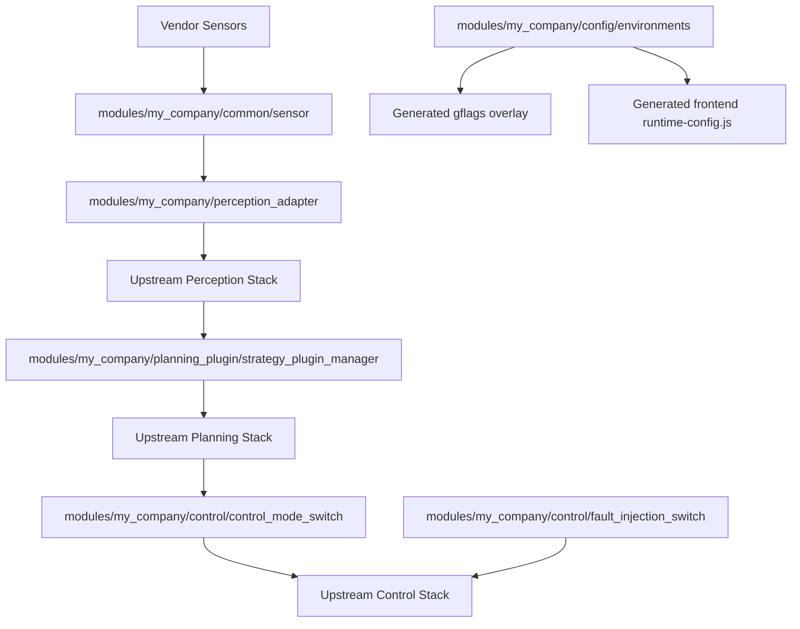
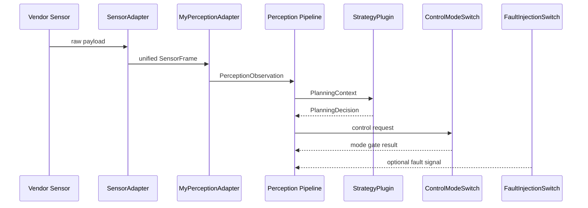

# Modified by however-yir autonomous driving team

# Module Topology And Dataflow

## Topology

```mermaid
graph TD
    SENSOR[Vendor Sensors] --> ADAPTER[modules/my_company/common/sensor]
    ADAPTER --> PERCEPTION_ADAPTER[modules/my_company/perception_adapter]
    PERCEPTION_ADAPTER --> PERCEPTION[Upstream Perception Stack]

    PERCEPTION --> PLUGIN_MGR[modules/my_company/planning_plugin/strategy_plugin_manager]
    PLUGIN_MGR --> PLANNING[Upstream Planning Stack]

    PLANNING --> CONTROL_SWITCH[modules/my_company/control/control_mode_switch]
    CONTROL_SWITCH --> CONTROL[Upstream Control Stack]

    FAULT_INJECT[modules/my_company/control/fault_injection_switch] --> CONTROL
    ENV_CONFIG[modules/my_company/config/environments] --> FLAGFILE[Generated gflags overlay]
    ENV_CONFIG --> RUNTIME_JS[Generated frontend runtime-config.js]
```

## Dataflow

```mermaid
sequenceDiagram
    participant VS as Vendor Sensor
    participant SA as SensorAdapter
    participant PA as MyPerceptionAdapter
    participant PP as Perception Pipeline
    participant SP as StrategyPlugin
    participant CS as ControlModeSwitch
    participant FI as FaultInjectionSwitch

    VS->>SA: raw payload
    SA->>PA: unified SensorFrame
    PA->>PP: PerceptionObservation
    PP->>SP: PlanningContext
    SP-->>PP: PlanningDecision
    PP->>CS: control request
    CS-->>PP: mode gate result
    FI-->>PP: optional fault signal
```
